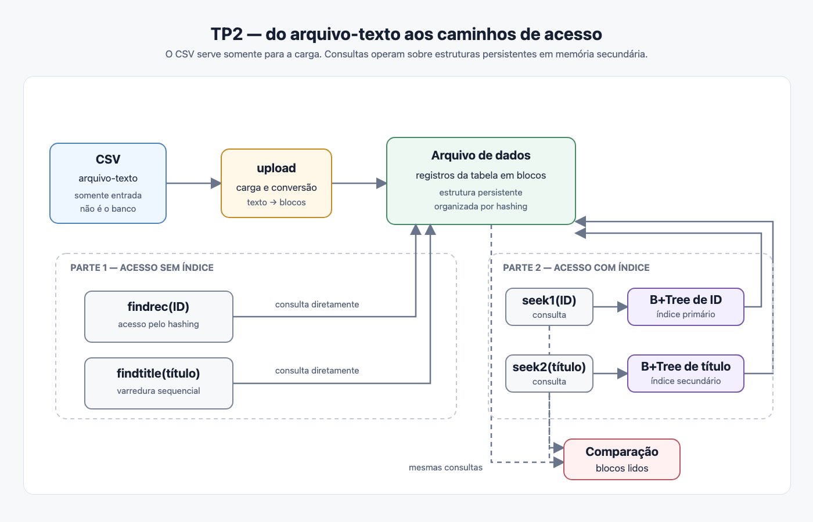

Universidade Federal do Amazonas
Instituto de Computação
Introdução a Bancos de Dados — ICC205 — 2026/02
Docente: Altigran Soares da Silva <alti@icomp.ufam.edu.br>

# Trabalho Prático II — 10/09/2026
# Data da entrega: 10/10/2026 até 23:59

## 1. Apresentação

Este trabalho consiste na implementação de programas para armazenamento e consulta de dados em memória secundária, usando as estruturas de arquivo de dados e de índice estudadas na Unidade II. O trabalho é dividido em duas partes, que devem ser desenvolvidas e medidas separadamente:

- **Parte 1 — acesso sem arquivo de índice.** Um arquivo de dados organizado por hashing e buscas feitas diretamente sobre ele.
- **Parte 2 — acesso com arquivos de índice.** Um índice primário e um índice secundário, ambos em B+Tree armazenada em memória secundária, sobre o mesmo arquivo de dados da Parte 1.

O resultado que o trabalho deve produzir não é apenas o conjunto de programas funcionando. Também é importante a **comparação medida entre as duas partes**, sobre as mesmas consultas, expressa em número de blocos de memória secundária lidos. A análise dessa comparação é o objeto central da avaliação.

Em um SGBD relacional, uma tabela é uma abstração lógica. Para armazená-la e consultá-la, o SGBD implementa estruturas físicas em memória secundária. O **arquivo de dados** guarda os registros que materializam as tuplas da tabela. Os **arquivos de índice** mantêm estruturas auxiliares, com chaves e referências para os registros, destinadas a reduzir o custo de determinadas consultas. Os índices não substituem o arquivo de dados: eles oferecem caminhos de acesso mais eficientes até os dados.

Este trabalho reproduz uma parte desse mecanismo. Primeiro, os dados serão inseridos em um arquivo de dados paginado. Depois, serão construídos arquivos de índice sobre esse arquivo de dados. A comparação entre uma busca que usa diretamente a organização do arquivo de dados e uma busca que usa uma B+Tree deverá mostrar, concretamente, o que se ganha e o que se paga pela manutenção de índices. Não se deve pressupor que o uso de um índice será sempre mais barato: para uma busca exata por ID, a organização hash do arquivo de dados pode exigir menos leituras que o percurso pela B+Tree; para uma busca por intervalo, a ordenação das folhas da B+Tree oferece uma vantagem que o hashing não oferece. A Figura 1 sintetiza esse fluxo e destaca que as duas partes consultam o mesmo arquivo de dados, mas percorrem caminhos de acesso diferentes.



*Figura 1 — Do arquivo-texto de entrada às estruturas persistentes e aos caminhos de acesso comparados no TP2.*

Na consulta por intervalo, `findrange` segue o caminho de acesso direto ao arquivo de dados mostrado na Parte 1, enquanto `seekrange` segue a B+Tree de ID mostrada na Parte 2 e percorre suas folhas encadeadas.

O trabalho deve ser desenvolvido **individualmente** e implementado em **C++**, sobre Linux, utilizando as bibliotecas padrão e as chamadas de sistema disponíveis. O repositório-template fornece uma camada de acesso a blocos e o leitor do arquivo de entrada; a implementação das estruturas de dados é responsabilidade de cada estudante.

## 2. Arquivo de entrada

O arquivo fornecido é um **arquivo-texto de entrada**, no formato CSV. Ele contém a amostra oficial, com 204.279 registros sobre artigos científicos publicados em conferências, campos delimitados por aspas e separados por ponto e vírgula. A amostra é a mesma para toda a turma e foi extraída do conjunto original de 1.021.439 registros por amostragem sistemática, tomando um registro a cada cinco, o que preserva a faixa completa de identificadores.

Esse CSV **não é o arquivo de dados do banco** e não deve ser usado diretamente pelos programas de consulta. Seu papel termina na carga inicial: o programa `upload` deve lê-lo e transformar seus registros na representação física definida para o arquivo de dados paginado. As consultas posteriores devem acessar somente o arquivo de dados e, na Parte 2, os arquivos de índice produzidos pelo trabalho.

| Campo       | Tipo            | Descrição                                   |
| ----------- | --------------- | ------------------------------------------- |
| ID          | inteiro         | Código identificador do artigo              |
| Título      | alfa 300        | Título do artigo                            |
| Ano         | inteiro         | Ano de publicação                           |
| Autores     | alfa 150        | Lista de autores, separados por `\|`        |
| Citações    | inteiro         | Número de vezes que o artigo foi citado     |
| Atualização | data e hora     | Data e hora da última atualização dos dados |
| Snippet     | alfa 100 a 1024 | Resumo textual do artigo                    |

Exemplo de uma linha do arquivo:

```
"1";"Poster: 3D sketching and flexible input for surface design: A case study.";"2013";"Anamary Leal|Doug A. Bowman";"0";"2016-07-28 09:36:29";"Poster: 3D sketching and flexible ..."
```

A amostra oficial está disponível comprimida em [`artigo-amostra.csv.gz`](https://drive.google.com/file/d/1mUXzZ3ckewhY5uEQsCA0CP4kRjVhxFY8/view?usp=sharing) (204.279 registros, 33 MB comprimidos, 106 MB descompactados) e **não deve ser copiada para dentro da imagem Docker**. Antes da primeira carga, deve ser descompactado no diretório `data/` com `gzip -dk data/artigo-amostra.csv.gz`. O arquivo CSV resultante é montado em tempo de execução no diretório `/data`.

Observe que os campos têm tamanho variável. A definição do layout do registro em disco — tamanho fixo com truncamento, tamanho variável com indicador de comprimento, ou outra alternativa — é uma decisão de projeto, que deve ser justificada no relatório.

## 3. Camada de acesso a blocos

O template fornece a camada `blockio`, que é a **única** forma admitida de ler e escrever nos arquivos de dados e de índice. Ela oferece:

- `BlockFile::open(path, mode)` — abre ou cria um arquivo paginado;
- `BlockFile::read_block(index, buffer)` e `BlockFile::write_block(index, buffer)`;
- `BlockFile::alloc_block()` e `BlockFile::block_count()`;
- `BlockFile::stats()` — contadores de blocos lidos e escritos desde a abertura.

O tamanho do bloco é definido em tempo de compilação pela constante `BLOCK_SIZE`, com valor padrão de **4096 bytes**.

Dois pontos decorrem dessa camada e devem ser observados:

1. **A métrica do trabalho é contagem de blocos lógicos, não tempo.** O contador é incrementado a cada leitura lógica solicitada à camada, independentemente de disco, cache do sistema operacional ou máquina. O número obtido é determinístico e deve ser idêntico em qualquer computador que execute o mesmo programa sobre o mesmo arquivo.
2. **Nenhum acesso pode contornar a camada.** Qualquer leitura direta por `fstream`, `mmap` ou chamada equivalente sobre os arquivos de dados e índice invalida a medição e, portanto, o experimento.

Tempo de execução em milissegundos pode ser informado, mas não é comparável entre máquinas e não entra na avaliação.

## 4. Parte 1 — acesso sem arquivo de índice

Devem ser implementados:

**a) `upload <arquivo.csv>`** — carga inicial dos dados, criando o arquivo de dados organizado por **hashing**. O programa deve informar ao final: número de registros carregados, número de blocos do arquivo de dados, número de registros por bloco no layout adotado e taxa de ocupação dos blocos.

**b) `findrec <ID>`** — busca o registro com o ID informado diretamente no arquivo de dados, pela organização por hashing. Se o registro existir, mostra todos os campos. Em qualquer caso, informa a quantidade de blocos lidos na operação e a quantidade total de blocos do arquivo de dados.

**c) `findtitle "<Título>"`** — busca por título **percorrendo sequencialmente** o arquivo de dados, sem qualquer índice. Mostra os registros encontrados, a quantidade de blocos lidos e a quantidade total de blocos do arquivo.

**d) `findrange <ID-inicial> <ID-final>`** — busca todos os registros cujo ID pertença ao intervalo fechado informado, percorrendo sequencialmente o arquivo de dados, pois a organização por hashing não preserva a ordem das chaves. Mostra os registros encontrados, a quantidade de blocos lidos e a quantidade total de blocos do arquivo.

## 5. Parte 2 — acesso com índice

Sobre o mesmo arquivo de dados da Parte 1, devem ser construídos:

- um **índice primário** sobre o campo ID, em B+Tree armazenada em memória secundária;
- um **índice secundário** sobre o campo Título, em outra B+Tree em memória secundária.

Devem ser implementados:

**a) `seek1 <ID>`** — devolve o registro com o ID informado, pesquisando pelo índice primário. Informa os campos do registro, a quantidade de blocos lidos no arquivo de índice, a quantidade de blocos lidos no arquivo de dados e o total de blocos do índice primário.

**b) `seek2 "<Título>"`** — devolve os registros com o título informado, pesquisando pelo índice secundário, com as mesmas informações de custo.

**c) `seekrange <ID-inicial> <ID-final>`** — devolve, em ordem crescente de ID, todos os registros pertencentes ao intervalo fechado informado. A busca deve localizar a primeira chave pela B+Tree primária e percorrer sequencialmente as folhas encadeadas até ultrapassar o limite final. Informa separadamente os blocos lidos no índice e no arquivo de dados.

A construção dos índices pode ocorrer dentro do `upload` ou em um programa separado, desde que o relatório informe o custo dessa construção em blocos escritos e o repositório documente o comando.

## 6. Consultas oficiais de teste

O template inclui o arquivo `queries/oficial.txt`, com o conjunto de consultas que **toda a turma** deve executar e reportar. Ele contém:

- IDs existentes em diferentes pontos do arquivo;
- pelo menos um ID inexistente;
- títulos existentes, incluindo ao menos um título repetido em mais de um registro;
- pelo menos um título inexistente.
- intervalos de IDs com poucos e muitos resultados, além de um intervalo sem resultados.

Os números apresentados no relatório devem ser exatamente os produzidos pela execução dos programas da própria entrega sobre esse conjunto. A conferência será feita reexecutando os programas entregues e comparando os resultados com os do relatório.

## 7. Experimentos e relatório

O relatório, em arquivo único `docs/tp2_relatorio.pdf`, deve conter as seções abaixo.

**7.1. Decisões de projeto.** Layout do registro no bloco e sua justificativa; função de hashing adotada, número de buckets e tratamento de colisões e de overflow; estrutura do nó da B+Tree, cálculo da ordem a partir de `BLOCK_SIZE` e do tamanho da chave, e tratamento de chaves duplicadas no índice secundário.

**7.2. Previsão antes da medição.** Antes de executar, devem ser registrados: a ordem da B+Tree que o layout permite, a altura esperada da árvore para o número de registros carregados, o número esperado de blocos lidos por busca em cada uma das seis operações e o custo esperado das varreduras sequenciais. Esta seção deve ser escrita antes da seção 7.3.

**7.3. Medição.** Tabela com os resultados das consultas oficiais: para cada consulta aplicável, blocos lidos em `findrec`, `findtitle`, `findrange`, `seek1`, `seek2` e `seekrange`, com os totais de blocos de cada arquivo.

**7.4. Comparação e explicação das divergências.** Confronto entre 7.2 e 7.3. Onde o previsto e o medido divergirem, explicar a causa a partir da implementação. Divergências existem e não são penalizadas; o que se avalia é a explicação.

**7.5. Efeito do tamanho do bloco.** Repetir a carga e as consultas oficiais com `BLOCK_SIZE` de 8192 bytes e comparar com o resultado de 4096. A discussão deve relacionar a mudança ao número de registros por bloco, à ordem da árvore e à altura resultante.

**7.6. Casos patológicos.** O conjunto oficial inclui um título repetido, chaves inexistentes e intervalos com cardinalidades diferentes. Analisar o comportamento do sistema nesses casos: qual o custo de uma busca que não encontra nada em cada uma das duas partes, o que ocorre quando o índice secundário devolve múltiplos registros e como o tamanho do intervalo afeta o custo da B+Tree. Se a carga produzir concentração de registros em poucos buckets, essa ocorrência deve ser relatada e quantificada.

**7.7. Declaração de uso de ferramentas de IA.** Seção obrigatória. Deve informar quais ferramentas foram usadas, em que partes do trabalho, o que foi solicitado a elas e o que foi modificado posteriormente. **O uso declarado não implica desconto de nota.** O que se avalia é a consistência entre a declaração, o código entregue e as respostas na arguição.

## 8. Estrutura do repositório

```
/
├── src/            código C++
├── include/        headers
├── bin/            binários gerados (não versionados)
├── data/           vazio no repositório; usado em runtime
├── queries/        oficial.txt e demais consultas
├── docs/           tp2_relatorio.pdf
├── Dockerfile
├── docker-compose.yml
├── Makefile
└── README.md
```

O `Makefile` deve oferecer, no mínimo: `make build` (compilação local), `make docker-build` e `make docker-run-<prog>` para `upload`, `findrec`, `findtitle`, `findrange`, `seek1`, `seek2` e `seekrange`.

## 9. Execução

Todos os programas devem ser executáveis dentro do contêiner, usando `/data` para entrada e para persistência dos arquivos de dados e de índice, de modo que uma execução aproveite os arquivos criados pela anterior:

```
docker build -t tp2 .
gzip -dk data/artigo-amostra.csv.gz
docker run --rm -v $(pwd)/data:/data tp2 ./bin/upload /data/artigo-amostra.csv
docker run --rm -v $(pwd)/data:/data tp2 ./bin/findrec 1234
docker run --rm -v $(pwd)/data:/data tp2 ./bin/findtitle "Um título exato"
docker run --rm -v $(pwd)/data:/data tp2 ./bin/findrange 1000 1100
docker run --rm -v $(pwd)/data:/data tp2 ./bin/seek1 1234
docker run --rm -v $(pwd)/data:/data tp2 ./bin/seek2 "Um título exato"
docker run --rm -v $(pwd)/data:/data tp2 ./bin/seekrange 1000 1100
```

O `README.md` deve conter esses comandos, o layout dos arquivos gerados em `/data`, e um exemplo pequeno de entrada e saída. Nada pode depender de caminho absoluto fora de `/app` e `/data`, nem de recurso não documentado.

Cada programa deve imprimir, de forma legível: os caminhos dos arquivos usados, os blocos lidos na operação, os totais de blocos e mensagens de erro claras quando a consulta não encontrar resultado.

## 10. Entrega

A entrega é feita por **repositório GitHub individual e privado**, criado a partir do template `tp2-2026-02-template` na organização `bd1-icomp-ufam`. Cada estudante deve:

1. criar o repositório a partir do template;
2. adicionar o docente como colaborador;
3. marcar a versão final com a tag **`v1.0`**, exatamente com esse nome;
4. enviar a tag ao GitHub: `git push origin v1.0`.

Será corrigido o commit apontado pela tag `v1.0` no repositório remoto no encerramento do prazo. Antes do prazo, confirmar que a tag aparece no remoto:

```
git ls-remote --tags origin
```

Tags com outro nome, branches chamados `v1.0` e repositórios sem o docente como colaborador não caracterizam entrega.

## 11. Arguição

Após a entrega, toda a turma será chamada para uma **arguição individual experimental pelo Discord**, em data e hora agendadas, com perguntas sobre o código e os números do próprio relatório. A arguição compõe a nota conforme a Seção 12, mas terá peso reduzido nesta primeira aplicação. A ausência individual na data e hora agendadas zera esse item. O agendamento será feito por um formulário distribuído posteriormente.

## 12. Avaliação

- Implementação funcional das duas partes: **30%**
- Análise experimental e coerência entre relatório e execução: **50%**
- Arguição experimental pelo Discord: **10%**
- Rito de entrega e reprodutibilidade: **10%**

Divergência entre os números do relatório e os produzidos pela execução dos programas entregues é o item de maior peso negativo do trabalho.

## 13. Comentários gerais

Comece cedo. A Parte 1 pode ser desenvolvida a partir da aula de 22/09 (organização de arquivos) e a Parte 2 a partir de 29/09 (B+Tree); o trabalho foi dimensionado para acompanhar essas aulas, não para ser feito depois delas.

O uso de ferramentas de IA é permitido e deve ser declarado. O que o trabalho avalia não é a produção do código, e sim o entendimento do sistema construído: os números medidos, as decisões de projeto e a capacidade de explicar ambos.

## 14. Referências

1. ELMASRI, R.; NAVATHE, S. B. *Fundamentals of Database Systems*, 6ª ed. Addison Wesley, 2010. Capítulos 17 e 18.
2. GARCIA-MOLINA, H.; ULLMAN, J. D.; WIDOM, J. *Database Systems: The Complete Book*, 2ª ed. Prentice Hall, 2008. Capítulos 13 e 14.
3. FOLK, M. J.; ZOELLICK, B.; RICCARDI, G. *File Structures: An Object-Oriented Approach with C++*. Addison Wesley, 1998.
